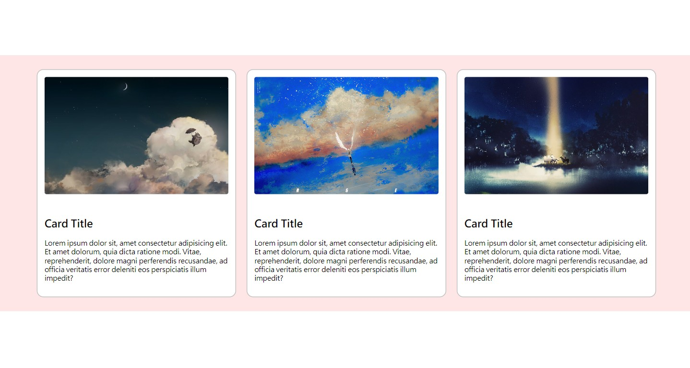
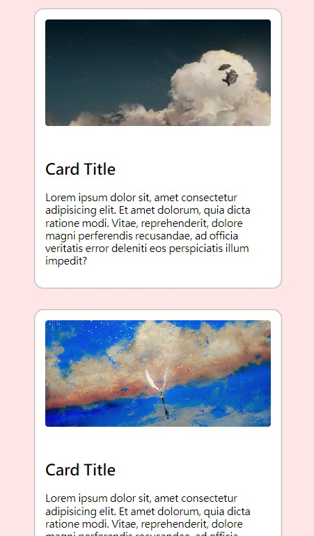

# Card Layout Practice

這是一個切版練習專案，目標是製作一個響應式的卡片排版區塊，具備圖片、標題、內容區域與 hover 動畫效果。

## 專案簡介

- 使用 HTML + CSS 實作，主要練習項目：
  - Flex 排版
  - RWD 響應式設計
  - 圖片等比例裁切（object-fit）
  - Hover 動畫效果（transform, box-shadow）
  - Media Query 手機版調整

## 響應式設計說明

- 1024px 以上為桌機版：三欄排版卡片
- 768px 以下為手機版：單欄直式卡片，自動換行並置中

## 技術練習重點

- Flexbox 對齊與排列
- RWD 排版邏輯
- object-fit: cover 讓圖片統一大小
- 使用 transition 製作滑入動畫效果
- 基本 hover 動畫效果設計

## 預覽畫面

## 未來可以加強的部分

- 圖片資料可以改為由 JavaScript 載入
- 樣式可以改用 SCSS 撰寫
- 嘗試加入更多互動元件（例如卡片收藏、按鈕等）

---

© 2025 by [Isagi]
